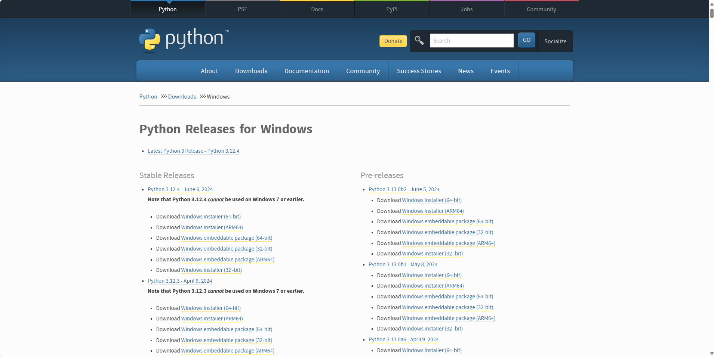
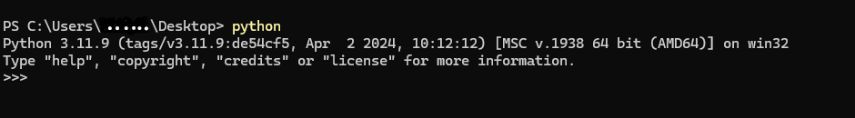
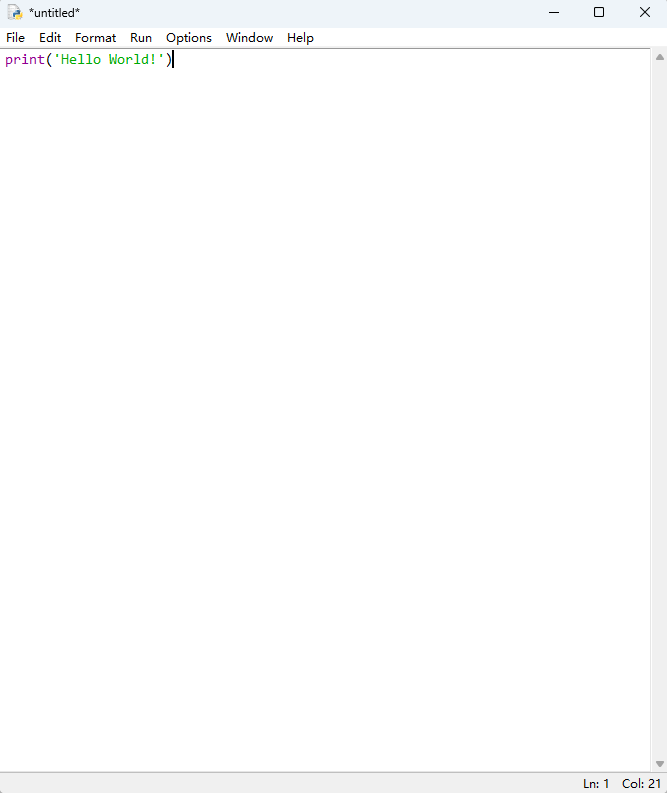
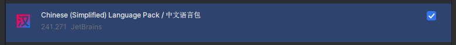

# 准备工作

> 在开始学习Python之前, 你需要做一些准备工作。
---

## 安装Python

你可以从[Python官网](https://www.python.org/)下载Python安装包。

**步骤如下:**

1. 进入[Python官网下载页面](https://www.python.org/downloads/)
2. 选择适合你的操作系统和位数的安装包
3. 下载并根据提示安装Python
4. 完成!

**验证安装是否成功:**

打开命令提示符(Windows)或终端(Mac/Linux)并输入`python`命令。如果出现Python的版本信息, 则说明安装成功。

> 如果你无法进入Python官网, 请尝试使用🪜梯子(懂得都懂)。或者你可以从可靠的应用商店下载, 例如电脑自带的Microsoft Store

> 请尽量从Python官方网站下载Python。现在有很多骗子网站, 让你付费下载, 这些都是假的, Python本身就是免费开源的。另外, 这些网站下载的Python很有可能包含病毒或恶意代码, 小心!

[更详细的安装教程](https://blog.csdn.net/qq_45502336/article/details/109531599?ops_request_misc=%257B%2522request%255Fid%2522%253A%2522171783700016800185847150%2522%252C%2522scm%2522%253A%252220140713.130102334..%2522%257D&request_id=171783700016800185847150&biz_id=0&utm_medium=distribute.pc_search_result.none-task-blog-2~all~top_positive~default-2-109531599-null-null.142^v100^pc_search_result_base1&utm_term=Python%E5%AE%89%E8%A3%85&spm=1018.2226.3001.4187)

## 安装代码编辑器或IDE

代码编辑器和IDE(Integrated Development Environment, 集成开发环境)是用来编程的工具。通过它们你可以更方便, 高效地编写代码。IDLE的源代码通常位于<根目录>/libs/idlelib中。

Python通常会自带一个简单的编辑器IDLE, 包含了语法高亮, 自动补全等基本功能。

IDLE功能有限, 你可以选择其他功能更强大的IDE或代码编辑器。以下是一些推荐的IDE:

- [PyCharm](https://www.jetbrains.com/pycharm/)
  最流行的Python IDE之一, 功能强大。有免费的社区版可以使用。专业版有更多功能, 例如支持Django开发。
- [Visual Studio Code(VS Code)](https://code.visualstudio.com/)
  微软推出的免费开源的轻量的代码编辑器, 支持多种编程语言。可以通过插件支持Python开发。

- [Atom](https://atom.io/)
  基于Electron的开源代码编辑器, 支持多种编程语言, 界面美观。

[更多推荐](https://blog.csdn.net/2301_80239908/article/details/133894391?ops_request_misc=%257B%2522request%255Fid%2522%253A%2522171783810416777224417966%2522%252C%2522scm%2522%253A%252220140713.130102334..%2522%257D&request_id=171783810416777224417966&biz_id=0&utm_medium=distribute.pc_search_result.none-task-blog-2~all~top_click~default-2-133894391-null-null.142^v100^pc_search_result_base1&utm_term=python%E7%BC%96%E8%BE%91%E5%99%A8&spm=1018.2226.3001.4187)

## 了解Python

Python（英国发音：/ˈpaɪθən/；美国发音：/ˈpaɪθɑːn/），是一种广泛使用的解释型、高级和通用的编程语言。Python支持多种编程范型，包括结构化、过程式、反射式、面向对象和函数式编程。它拥有动态类型系统和垃圾回收功能，能够自动管理内存使用，并且其本身拥有一个巨大而广泛的标准库。它的语言结构以及面向对象的方法，旨在帮助程序员为小型的和大型的项目编写逻辑清晰的代码。

吉多·范罗苏姆于1980年代后期开始研发Python，作为ABC语言的后继者，它也可以被视为采用了叫做M-表达式的中缀表示法的一种LISP方言。吉多·范罗苏姆于1991年首次发布 Python 0.9.0。Python 2.0于2000 年发布并引入了新功能。Python 3.0于2008年发布，它是该语言的主要修订版，并非完全向后兼容。Python 2于2020年随2.7.18版停止支持。

Python的设计哲学，强调代码的可读性和简洁的语法，尤其是使用空格缩进来划分代码块。相比于C语言或Java，Python让开发者能够用更少的代码表达想法。

Python解释器本身几乎可以在所有的操作系统中运行，它的官方解释器CPython是用C语言编写的。Python是一个由社群驱动的自由软件，目前由Python软件基金会管理。Python是最受欢迎的编程语言之一。

————以上内容来自[维基百科](https://zh.wikipedia.org/wiki/Python)

**简单介绍:**

Python是一种高级编程语言, 它由吉多·范罗苏姆(Guido van Rossum)于1991年发布。它是一种解释型, 面向对象, 动态数据类型的语言。它语法简单, 易于学习。被广泛应用于数据分析, 人工智能等领域。

————以上内容来自网站作者(语文不好555)

**百科链接:**

- [Wikipedia(维基百科)](https://zh.wikipedia.org/wiki/Python)
- [百度百科](https://baike.baidu.com/item/Python/407313) 

> Python是[TIOBE 编程社区指数](https://hellogithub.com/report/tiobe/)中排名第一的编程语言。(2024年5月)

## 拓展: PyCharm相关

PyCharm安装后默认是英文的, 你可以通过安装`Chinese (Simplified) Language Pack / 中文语言包`插件来切换到中文。

在欢迎窗口侧边栏找到并点击`Plugins`, 这是PyCharm的插件页面。

